# Pricing and Positioning Report for

## Executive summary

The strongest market signal for this studio is not “cheap websites versus expensive websites.” It is “generic digital output versus working business assets.” New Zealand consumer research is unusually helpful here: nearly half of NZ businesses still do not have a website, only four in ten sole traders do, yet almost three-quarters of consumers say a website is the most important way for businesses to engage with them. The same research also shows consumers increasingly expect tools and responsiveness, including AI-assisted help, while businesses still underestimate what websites are expected to do. That gap is exactly the opening for a scope-first offer that explains the invisible work behind a site: messaging, setup, routing, reliability, analytics, handover, and automation. citeturn37view0

The public market now breaks into four clear layers. First, DIY and AI builders make launch costs feel close to zero: free plans, low monthly subscriptions, AI site generation, AI logos, and entry ecommerce are everywhere. Second, low-cost done-for-you and marketplace services sit in the “fast and affordable” zone. Third, structured small-business agencies sell editable CMS builds, support retainers, and channel-specific services with transparent starting points. Fourth, higher-end agencies and product-design firms price around business complexity, integrations, UX risk, and operational impact rather than page count. The result is that a business owner really can get “a site” cheaply, but the market also clearly prices upward for conversion logic, workflow depth, governance, and reliability. citeturn7view2turn6view2turn6view3turn6view4turn7view0turn18view0turn19view4turn29view1

Public proof already on the studio’s own site points to a sensible positioning wedge: strategy-first, owner-friendly, AI-assisted, and transparent about when a productized DIY path is enough and when a custom engagement is warranted. The current playbook page sells a one-off strategy product for $99 and explicitly anchors it against a brand-strategist engagement of $3,000 to $5,000. That is not a side note. It is the commercial logic. It says: “we can package thinking, not just hours,” and “we are comfortable helping people start smaller, then graduate into deeper work.” That is a powerful trust signal in a market where many agencies still hide pricing until after a call. citeturn38search0

The recommended pricing architecture is therefore not fixed-package pricing in the traditional sense. It should be planning ranges in NZD, tied to business outcomes and build shapes rather than page counts: **Front Door**, **Clear Offer**, **Lead Engine**, and **Business System**. Each should be presented as a planning band, then decomposed into visible inclusion layers: foundation, conversion, and advantage. That allows the studio to work to budget without collapsing back into cheap-page logic. It also gives the Build Map tool a clear commercial job: reveal what is actually inside the work, create a sensible first-scope draft, and turn the result into a lead-ready brief. The strongest monetization opportunities are the parts most competitors still leave invisible: discovery, message clarity, domain and email setup, form routing, search/indexing setup, analytics, content systems, automations, dashboards, staged rollout, documentation, and owner handover. Those are exactly the differentiators that cheap builders and low-cost freelancers underserve. citeturn18view0turn19view0turn19view1turn21view0turn30view0turn31search14turn31search1turn25search1turn26search3

## Market price ranges and deliverables

The core pricing lesson from the market is that “website” and “logo” are not products with single prices. They are categories with very different depths of work. Public pricing pages repeatedly separate the cheap path from the structured professional path by whether the offer includes strategy, copy, integrations, QA, support, and measurable outcomes. That is the frame the studio should adopt as well. citeturn19view0turn19view1turn21view0turn29view1

```mermaid
xychart-beta
    title "Typical small-business price bands by service type"
    x-axis ["Quick logo","Brand identity","One-page site","Brochure CMS","Lead-gen site","E-commerce","SEO monthly","PPC monthly","Dashboard","Custom system"]
    y-axis "Typical observed market band" 0 --> 50000
    bar "Low" [20,1000,1000,3000,5000,5000,300,500,2000,10000]
    bar "High" [350,5000,10000,15000,25000,50000,5000,10000,30000,50000]
```

The chart above is a synthesis of the public bands shown in the tables below and should be read as order-of-magnitude positioning, not FX-exact conversion, because the underlying sources are a mix of NZD, AUD, USD, and GBP. citeturn16view2turn18view0turn19view1turn19view2turn21view0turn30view0turn33search8turn33search17

### Websites, CMS, ecommerce, and maintenance

| Service type | Low public entry | Structured agency or system band | Typical deliverables buyers actually get | Evidence |
|---|---:|---:|---|---|
| One-page brochure or landing page | NZ$1,000 for a one-page local web design offer; builder plans can start free or below NZ$30/month equivalent | US$5,000–$10,000 for agency landing pages; small agency projects commonly enter the low five figures | Responsive design, core sections, contact form, mobile fit, basic SEO setup, often basic analytics and a CMS/editor on the higher path | citeturn16view2turn7view2turn29view1 |
| Multi-page brochure CMS site | NZ$3,000 for a five-page local build | US$4,500–$15,000 on productized WordPress builds; US$10,000–$20,000 as a common small-business agency band | 5–15 core pages, editable CMS, forms, custom design, project management, QA, basic SEO structure, sometimes copy assistance and training | citeturn16view2turn18view0turn29view1 |
| Conversion-focused service site | Often starts where standard brochure sites stop, around custom-quoted low five figures | US$25,000–$50,000 for mid-complexity sites with custom UX flows, stronger integrations, portals, dashboards, performance and security hardening | Discovery, messaging structure, conversion-focused page hierarchy, advanced forms, landing pages, integrations, event tracking, stronger QA | citeturn18view0turn29view1 |
| Ecommerce site | Platform entry can be as low as US$29/month on a commerce plan, before build labor and apps | Implementation can quickly move into the tens of thousands for custom UX, integrations, regional logic, or higher-volume setups; enterprise platform fees alone can exceed US$2,300/month | Store setup, product collections, checkout, payments, shipping/tax configuration, product content, merchant analytics, marketing integrations | citeturn6view2turn19view4turn29view1 |
| Editable CMS and publishing layer | Builder and hosted-CMS entry from low monthly subscriptions | Custom-managed CMS builds priced with design, training, and governance layered in | Editor access, structured content types, publishing workflows, blogs or other content collections, owner handover | citeturn7view0turn34search3turn18view0 |
| Maintenance and care plans | Managed hosting starts around US$30/month; some builder plans include support as part of subscription | Structured support commonly ranges from US$99 to US$799/month, plus hosting, edge/security, or deploy tooling | Updates, backups, uptime monitoring, emergency support, page edits, ticketing, security optimization, sometimes a site manager and monthly planning | citeturn18view0turn25search1turn25search0 |

### Branding, ads, copy, SEO, and content engines

| Service type | Low public entry | Structured agency or system band | Typical deliverables buyers actually get | Evidence |
|---|---:|---:|---|---|
| Quick mark or simple logo | AI logo tools from US$20 for a basic package; low-cost local logo offers around NZ$350; contest marketplaces from US$299 | Higher-quality execution still often stays under the low four figures if strategy is light | One primary mark, limited concepts or revisions, PNG/SVG/PDF output, sometimes vector files, minimal usage guidance | citeturn5search18turn12search0turn13search4 |
| Identity refresh | NZ$1,000–$1,950+ is a very common public local band | Mid four figures when guidelines and extra brand collateral are included | Logo variations, colour palette, fonts, light brand guide, profile graphics, business card or core collateral | citeturn33search8turn33search13turn16view3turn33search17 |
| Full small-business brand system | A$1,295 and up on all-inclusive SMB brand packages | Often several thousand dollars once photography, wider asset sets, and a website are included | Visual identity system, guidelines, collateral, social assets, sometimes site design or photography bundled in | citeturn16view3turn16view1turn33search17 |
| Ad campaign setup and first-month management | NZ packages are publicly offered from around NZ$840–NZ$1,450 excluding media spend | Google Ads service plans commonly show first-month optimization from US$1,200 upward; broader agency management often lands at US$1,000–$3,000 monthly or 10%–20% of spend | Research, keyword selection, account setup, tracking installation, landing page setup or templates, reporting, optimization, remarketing and testing on higher tiers | citeturn33search3turn33search10turn21view1turn21view0 |
| Copywriting and messaging | Marketplace copywriting commonly lands around US$19–$45/hour; web copy is often priced per page | Sales copy specialists often sit higher, and agency-led web copy is usually bundled into site projects | Messaging hierarchy, web copy, calls to action, service-page narrative, often CRO-informed structure rather than “just words” | citeturn19view0turn32search2turn32search5 |
| SEO foundations | Audits start in the low hundreds; monthly SEO ranges commonly from US$500 to $5,000; small business bands cluster lower than enterprise | Small businesses often land around US$1,500–$3,500 monthly in surveyed benchmarks | Technical review, metadata and structure, local listing work, content advice, ranking and AI-visibility support, basic measurement | citeturn18view0turn19view1turn22search1 |
| Content engine and blog production | DIY content tooling from about US$60/month; productized blog writing from US$549/month | Human-produced blog content often lands around US$150–$600 per post, with higher bands for long-form strategic work | Topic planning, briefs, article production, content optimization, update workflows, publication support, sometimes AI-assisted drafting with human editing | citeturn18view0turn19view2turn34search2 |

The useful interpretation for the studio is straightforward: the market is already teaching customers that low-cost versions exist, but it is also teaching them that once copy, SEO structure, tracking, and conversion logic enter the picture, pricing rises because the deliverable changes from “a page” to “a revenue-bearing system.” That is the language the studio should use. citeturn19view0turn19view1turn21view0turn29view1

## Advanced offerings and invisible-value systems

This is where the studio has the best margin potential. Public pricing shows that advanced work is rarely sold as a fixed menu. It is sold as software subscriptions plus implementation, or as bespoke product/service work priced by risk, workflow complexity, and operational value. The most valuable move for the studio is therefore to expose these capabilities as optional layers inside the Build Map instead of hiding them behind a generic “custom quote.” citeturn22search3turn24search1turn24search2turn24search3turn30view0turn31search1turn29view0

| Advanced offer | Public software or product anchor | Typical implementation band | What buyers expect to receive | Evidence |
|---|---:|---:|---|---|
| AI playbooks and owner-guided systems | Current public anchor on the studio site is $99 one-off, explicitly contrasted with a $3,000–$5,000 strategist engagement | Practical custom versions will usually price above pure templates and below bespoke systems | Personalized prompts, worksheets, decision frameworks, update pathways, owner handover, and a clear “do it yourself or hand it over” path | citeturn38search0 |
| Workflow automations | Entry platform fees commonly start in the low tens per month and then scale by tasks, executions, seats, or usage | Useful business automations often begin with a few hundred dollars of simple marketplace help, then move into low-to-mid four figures for stable multi-step workflows; larger scoped system work can go much higher | App connections, trigger/action logic, error handling, retries, permissions, dashboards or tables, admin documentation, and owner training | citeturn22search3turn24search1turn24search14turn24search15turn31search14turn31search2 |
| Dashboards and reporting hubs | Live infrastructure can add ongoing monthly cost even when the build is one-off | Public NZ dashboard work ranges from about $2,000–$10,000 for operational dashboards, $5,000–$20,000 for live dashboards, and $4,000–$30,000 for executive dashboards | KPI workshop, data modelling, integrations, visual design, testing, training, documentation, and maintenance procedures | citeturn30view0 |
| Custom backend integrations | Simple API endpoint or glue work can start a few hundred dollars on marketplaces | Development-company bands commonly start around US$10,000–$49,000; broader custom web apps routinely stretch from US$15,000 to well above US$100,000 | API and CRM connections, quoting or booking logic, portal-style workflows, sync jobs, owner/admin handover, and change control | citeturn31search14turn31search1turn31search3turn31search11 |
| Advanced UI, UX, and interaction design | Design subscriptions can start around US$4,995/month for senior external design capacity | Project-based UI/UX agency work commonly ranges from US$10,000 for smaller MVPs to US$150,000+ or more for deeper systems; dashboard-specific UX is often quoted from about US$5,000 upward | Discovery, flows, wireframes, design systems, state handling, testing, developer handoff, and iteration | citeturn28view0turn29view0turn27search5 |
| Enterprise-grade reliability layer | Managed hosting starts around US$30/month; edge/security plans can add from about US$20–$25/month upward; deploy/app platforms add their own layer | Structured care plans commonly run from US$99–$799/month before larger SLA-style or enterprise arrangements | Backups, staging, uptime monitoring, security rules, CDN/WAF, deployment guardrails, incident support, version rollback, and ownership documentation | citeturn25search1turn25search0turn26search3turn25search2turn18view0 |

The key commercial message is that these advanced offers are not “extras” in the decorative sense. They are the items that change how a site behaves as a business asset. They are also the easiest parts of the offer to make visible inside the Build Map through checklists, badges, and phased recommendations. That is where the studio can monetize transparency itself. citeturn30view0turn31search14turn25search1

## Packaging models and benchmarked competitors

The public market currently uses four packaging models more than any others. One is the **transparent one-off build**. Another is the **monthly support retainer**. A third is the **done-for-you subscription with upfront setup fee**. The fourth is the **design subscription**. The reason this matters is that customers are already learning to think in phases and service shapes. A studio that says “we work to budget, we phase sensibly, and we will show you what is now, later, or DIY” is not introducing a strange buying model. It is adopting the clearest patterns already visible in the market. citeturn18view0turn16view6turn28view0turn38search0

### Comparable agencies, studios, and adjacent models

| Comparable provider | Public scope | Public price signal | Positioning | Key differentiator | Source |
|---|---|---:|---|---|---|
| entity["organization","Pronto Marketing","wordpress agency"] | WordPress support, website builds, SEO, blog writing, Google Ads | Support from US$99/month; website builds from US$4,500; SEO/AI audit from US$300; Google Ads from US$500/month | Productized small-business WordPress support and growth services | Strong separation between build, support, and marketing add-ons; very transparent support tiers | citeturn18view0 |
| entity["organization","UENI","done for you website service"] | Done-for-you websites, launch, support, growth services | Launch from £189.90 + setup; Growth from £949.90 yearly + setup; ready in 7 days | Low-cost managed website service for small businesses | Built-for-you model with training call, hosting, SSL, and managed support | citeturn16view6 |
| entity["organization","WebFX","digital marketing agency"] | Web design, SEO, PPC, content marketing | Small-business sites often US$1,000–$48,000 overall; SEO US$1,000–$5,000/month; PPC US$1,000–$10,000/month | Revenue-led mid-market digital agency | Large public benchmark library; prices framed around business size and channel maturity | citeturn19view4turn19view1turn21view0 |
| entity["organization","Brand Merchant","nz design studio"] | Brand design and small-business web design | Brand design from NZ$1,000; one-page site from NZ$1,000; five-page site from NZ$3,000 | Accessible local NZ studio for brand and small websites | Transparent NZ entry points with strong confidence/clarity framing | citeturn16view2turn33search8 |
| entity["organization","Design Garage","nz design studio"] | Logo, branding, custom websites, full brand+website packages | Custom websites from NZ$5,000 | Bespoke creative partner for growing local brands | Clear move from logo-only work into bundled brand, photo, and website packages | citeturn15search4turn16view1 |
| entity["organization","DigitUX","brisbane digital agency"] | Branding, automations, maintenance, hosting | Branding from A$1,295 | Small-business digital transformation agency | Brand package lives beside maintenance, automations, and operational services | citeturn16view3 |
| entity["organization","The New Black","nz marketing agency"] | Google Ads setup and management | Example monthly optimization/reporting package shown from NZ$840 excluding ad spend | NZ performance-marketing specialist | Transparent ads pricing with ad spend kept separate | citeturn33search3 |
| entity["organization","Run Wild Studio","nz google ads studio"] | PPC setup, landing pages, tracking, monthly reporting | NZ$1,200–NZ$1,450 excl. GST, excluding ad spend | Campaign-led studio selling PPC as a packaged service | Includes landing page setup and tracking in the offer, not just media buying | citeturn33search10 |
| entity["organization","Mata Digital","nz digital agency"] | Logo and brand identity packages | Bronze brand identity package from NZ$1,499 + GST | Tiered NZ branding offer | Clear distinction between refresh/basic identity and deeper brand tiers | citeturn33search13 |
| entity["organization","Small Business Web Designs New Zealand","nz web design service"] | Low-cost web and graphic design packages | Custom logo NZ$350; branding pack NZ$499 | Budget-sensitive small-business supplier | Very transparent low-end pricing, useful as a comparison anchor in sales | citeturn13search4 |
| entity["organization","Designjoy","design subscription service"] | Ongoing design, UI/UX, Webflow, branding | US$4,995/month | Subscription alternative to agencies and freelancers | Pause/cancel model and “one request at a time” simplicity | citeturn28view0 |

The strategic read for the studio is that most transparent competitors narrow the offer so pricing feels easy: either low-cost website production, low-cost support, low-cost branding, or one channel like paid ads. The opportunity is to keep clarity without shrinking capability. The studio can do that by quoting in layers, not by pretending everything is a simple package. citeturn18view0turn16view6turn16view2turn33search10turn28view0

## DIY and low-cost alternatives

This part matters because the objection is real. Customers are not inventing the idea that they can get a site, logo, or store very cheaply. They can. The studio should never argue against that reality. It should argue that cheap launch paths and high-performing business assets are different purchases. citeturn7view2turn6view2turn6view3turn6view4turn7view0turn5search18turn12search0

| Low-cost alternative | What it covers | Public price signal | Positioning | Limitation relative to a scope-first studio | Source |
|---|---|---:|---|---|---|
| entity["organization","Wix","website builder"] | Site builder, AI tools, ecommerce, logo tools | Free tier; paid annual plans shown at about $17.77, $29.77, $39.77, and $159.77 including GST on the viewed page | DIY builder for broad SMB use | Low friction to launch, but strategy, setup judgment, and conversion architecture still sit with the owner | citeturn7view2 |
| entity["organization","Squarespace","website platform"] | Sites, commerce, booking, analytics | Official pricing signals start around US$16/month and rise to about US$99/month; fees/features improve by plan | Design-led DIY and hosted services platform | Strong presentation layer, but still self-scoped and owner-run unless paired with an expert | citeturn4search11turn10search8turn10search9 |
| entity["organization","Shopify","commerce platform"] | Ecommerce platform, payments, B2B, checkout | Basic US$29, Grow US$79, Advanced US$299, Plus US$2,300/month on annual terms | Commerce-first platform | Platform cost is only a slice of the real implementation and operations budget | citeturn6view2 |
| entity["organization","Hostinger","hosting and website builder"] | Builder, templates, AI logo maker, AI SEO assistant, email campaigns | Introductory builder plans shown at US$2.99–US$3.99/month with higher renewals | Low-cost AI-assisted website launch | Very inexpensive to start, but still assumes the owner can make the stack work coherently | citeturn6view3 |
| entity["organization","Durable","ai business builder"] | AI website, CRM, AI chat, images, bookings/payments | Free, Launch at about US$22/month annual, Grow at about US$85/month annual | AI-first business site and operations starter | Excellent for speed, but not a substitute for deeper positioning, integration design, or custom workflows | citeturn6view4 |
| entity["organization","Framer","website platform"] | Site design, CMS, SEO, hosting, staging | Basic US$10, Pro US$30, Scale US$100/month annual | Higher-design builder for modern sites | Strong design and hosting, but still leaves message strategy and business systems design to the buyer | citeturn7view0 |
| entity["organization","Looka","ai logo platform"] | AI logo and brand-kit creation | Official pricing signals at US$20 for basic logo files and US$65 for premium assets | Fast DIY branding for founders | Useful for speed and placeholders, but not for differentiated identity strategy or market positioning | citeturn5search18 |
| entity["organization","99designs","design marketplace"] | Contest or marketplace-based logo and web design | Logo contests from US$299–$1,299; logo+brand guide from US$429–$1,479; webpage design estimated at US$629–$2,999 | Accessible custom design marketplace | Better than pure DIY for visuals, but still fragmented versus a unified message, build, and systems partner | citeturn12search0turn12search1turn12search7 |

The most effective rebuttal to “but I can get it cheaper” is therefore not defensiveness. It is comparison by hidden workload. Cheap options are optimized for launch velocity. A premium studio is optimized for clarity, performance, ownership, change readiness, and reduced operational risk. The Build Map should make those differences physically visible. citeturn7view2turn6view3turn6view4turn18view0turn25search1

## ICP implications and the best pricing posture

A precise persona-by-persona pricing model is not publicly available in one clean source, so this section is an inference from the prices above, from NZ consumer research, and from how platforms and agencies segment service businesses. The high-confidence takeaway is that all four target groups buy trust and clarity first, then buy workflow depth only when they can see the operational payoff. InternetNZ’s 2025 research is especially important: consumers put websites ahead of social channels for business engagement, and many sole traders still underinvest in websites. Separately, broader customer-experience research shows poor digital experiences directly drive churn. citeturn37view0turn35search3

| ICP segment | Price sensitivity | What usually closes the deal | What creates hesitation | Best Build Map output |
|---|---|---|---|---|
| Professional services | Medium | Clear positioning, trust, professional fit, easy enquiry path, polished copy, owner-editable CMS | Fear of overpaying for something that “looks simple” | **Clear Offer** |
| Allied health and wellness | Medium | Trust, calm UX, intake clarity, booking/referral flow, reliable contact routing, compliance-minded handover | Concern about complexity, patient confusion, or support risk | **Clear Offer** or **Lead Engine** |
| Consultants, coaches, specialists | Medium to high | Offer clarity, authority, lead magnet or booking flow, easy content publishing, conversion-focused messaging | Unclear ROI, overbuilt stack, confusing tech overhead | **Clear Offer** or **Lead Engine** |
| Trades and home services | High on headline price, lower on cost-per-lead if value is visible | Fast trust signals, proof, mobile-first contact flows, quote forms, reviews, speed, route-to-call simplicity | “I just need a website” framing, low confidence in digital jargon, limited appetite for discovery workshops | **Front Door** first, then **Lead Engine** as proof builds |

For the studio, that implies a pricing posture that stays transparent but avoids hard commodity pricing. These buyers do not need a public line item for every micro-task. They need a credible planning band, a short explanation of what changes when complexity increases, and the confidence that they can start at the right level now and extend later. That is especially true for sole traders and trades, where the buying decision is often less about total budget than about not feeling trapped in the wrong build. citeturn37view0turn18view0turn29view1

The public playbook positioning already supports that stance well. It says the studio is willing to let an owner handle the strategy themselves for $99 if that is the right call. That dramatically improves trust when the studio then says, on a custom build, “here’s what should be DIY, here’s what should be done properly the first time, and here’s what can be phased.” Very few agencies can say both of those things credibly. citeturn38search0

## Recommended pricing architecture and Build Map UX

The recommendation is to avoid classic “Starter / Growth / Premium” package prices and instead publish **planning ranges** in NZD, tied to build shape and system depth. Public market data supports a strong middle position here: above low-cost site sellers and pure builders, but below the upper mid-market agency zone where custom service sites regularly enter US$10,000–$20,000 and more. That leaves room for a premium small-business studio that is strategy-first, highly transparent, and willing to phase intelligently. citeturn16view2turn18view0turn19view4turn29view1turn38search0

### Recommended NZD pricing architecture

| Build shape | Recommended planning range | Best for | Minimum inclusions that should be visible in the scope | Common phase-two moves | DIY or owner-saver options |
|---|---:|---|---|---|---|
| **Front Door** | **NZ$2,500–$6,000** | New businesses, sole traders, simple service offers, trades that need credibility fast | Core messaging structure, responsive build, contact route, domain/email guidance, basic search/indexing setup, analytics baseline, owner handover | Case studies, review proof, quote forms, booking logic, content sections | Owner supplies imagery; owner enters service copy from a guided worksheet; playbook-based prep |
| **Clear Offer** | **NZ$6,000–$12,000** | Professional services, allied health, consultants, businesses whose issue is clarity rather than pure complexity | Discovery, message hierarchy, 5–10 page editable site, form logic, basic local SEO foundations, stronger analytics/events, polished visual system, training | Lead magnets, campaign landing pages, nurture flows, blog/content engine | DIY content population; owner-managed simple blog cadence with studio setup |
| **Lead Engine** | **NZ$12,000–$25,000** | Businesses that need better-quality enquiries, better qualification, or campaign readiness | Offer strategy, conversion page architecture, lead-source tracking, CRM/inbox routing, landing pages, segmented forms, remarketing/measurement readiness, stronger reporting | Automations, AI chat, quoting flow, deeper content system, ad creative support | Shared service model where some content or campaign operations stay owner-side |
| **Business System** | **NZ$25,000–$80,000+** | Multi-role businesses, heavy backend logic, dashboards, custom workflows, richer reliability needs | Custom integrations, dashboards, portals, workflow automation, advanced UX, staging and rollback discipline, deeper QA and governance, documented handover plan | Additional business units, deeper reporting, mobile workflows, SLA-style support | Usually limited; savings come from phasing, not from shifting core build work onto the owner |

The messaging around those bands should be consistent and simple:

- **Use “planning range,” “typical investment,” or “most projects land between.”**
- **Do not use “from” by itself without saying what raises or lowers scope.**
- **Promise a fixed quote only after the Build Map or a paid scoping step defines the required layers.**
- **Make it clear that budget can shape scope, but not the quality threshold.**

That last point is crucial. The studio should explicitly say that it can scale breadth, not standards. In other words: fewer layers now, not sloppier implementation now.

### Suggested add-ons and recurring offers

| Offer | Recommended NZD band | Notes |
|---|---:|---|
| Brand identity refresh | NZ$1,500–$4,000 | Best sold before or with **Front Door** and **Clear Offer** |
| Full brand system | NZ$4,000–$10,000+ | Strong upsell where positioning and visual confidence both need work |
| SEO foundations sprint | NZ$1,000–$3,000 | Technical tidy-up, local profile cleanup, metadata, indexing, basic AI-visibility prep |
| Content engine setup | NZ$750–$3,500 | Depends on whether it is merely structure and prompts or includes recurring production |
| Single useful automation | NZ$1,000–$5,000 | Very attractive bridge offer between **Clear Offer** and **Lead Engine** |
| Dashboard/reporting hub | NZ$4,000–$20,000+ | Scope by data sources and refresh requirements |
| Care plan | NZ$150–$750/month | Anchor against the market’s US$99–$799 support bands and hosting/security layers |

### Where the premium advantages should be monetized

| Premium advantage | How to charge for it | How to message it |
|---|---|---|
| Transparency | Planning ranges, phased scope, separate one-off and recurring costs | “You’ll see what is core, what is optional, and what can wait.” |
| Imagination | Higher-tier concepting, conversion structure, custom interactions, “unleash the idea” mode | “Give us your goal and constraints, and we’ll show the version you would not have asked for yourself.” |
| Obsessive quality control | Built into minimum tier standards; deeper QA/reliability added at higher tiers | “Similar-looking sites can carry very different levels of rigor behind the scenes.” |
| Backend tools | Price as **Advantage** or **System** items, not buried in web-design hours | “This is the part that saves time, routes leads, and keeps the site useful in six months.” |
| DIY exit path | Sell playbooks, setup-only engagements, training, documentation, and owner handover | “We are comfortable helping you do part of it yourself, because the right part done properly still matters.” |

### Suggested visual cues for the Build Map demo

The Build Map should communicate invisible value without turning into a quote spreadsheet. The best way is to use **scope evidence**, not pricing widgets. A simple pattern works well:

| UX cue | What it shows | Why it matters |
|---|---|---|
| **Looks the same, works differently** cards | Two visually similar sites with different behind-the-scenes checklists | Directly addresses the “why is this one more expensive?” objection |
| **Behind the scenes** checklist | Domain, DNS, email routing, forms, analytics, indexing, backups, uptime, handover, editing rights | Makes technical setup feel concrete and valuable |
| **Now, later, DIY** tags | Which items are in phase one, phase two, or owner-doable | Supports work-to-budget without devaluing the studio |
| **Business asset score** | Foundation, conversion, advantage | Reframes the buy away from page count |
| **Reliability badges** | Backups, staging, rollback, monitoring, security | Helps justify higher minimums for serious businesses |
| **Owner control badges** | “Your accounts,” “editable by you,” “handover included” | Valuable against low-cost providers that subtly create lock-in |

The lead-capture mechanic should be equally simple. The primary action should be to **email the Build Map to the owner** and the secondary action should be to **send it for studio review**. Both actions should send the same structured payload to the form endpoint: selected problems, recommended build shape, mode, now/later/DIY items, notes, and source. The page should also show the summary immediately on-screen so the user gets value before submitting. That way the form is a continuation of the tool, not a separate sales wall.

## Risks, rebuttals, and source priority

The central sales risk is not cheap competition. It is scope confusion. If the studio talks like everyone else, it will get compared like everyone else.

### Common objections and the strongest rebuttals

| Objection | What is true inside the objection | Strong rebuttal |
|---|---|---|
| “I can get a site for $200, or free.” | Yes. The market absolutely offers no-cost or very low-cost launch paths. | “You can buy launch cheaply. What you are paying us for is clarity, setup, lead flow, reliability, and ownership.” Builder plans and AI launch tools prove the first half; support, hosting, and agency bands prove the second. citeturn7view2turn6view3turn6view4turn18view0turn25search1 |
| “A $5,000 site can look like a $1,000 site.” | Also true. Appearance alone is a poor buying lens. | “That is exactly why we scope the invisible parts in public: message architecture, conversion logic, integrations, analytics, backups, and handover.” citeturn19view0turn18view0turn25search1 |
| “I just need a logo.” | Sometimes a simple mark really is enough for now. | “Great — we can tell you when simple is enough, and when lack of identity clarity will make the site or ads underperform.” The studio’s own productized strategy angle makes this credible. citeturn38search0turn33search8turn33search13 |
| “Why not run ads first?” | Paid traffic can create quick movement, but it also magnifies weak positioning. | “Ads are an amplifier. If the offer and page are unclear, you simply pay to learn that faster.” Public pricing for audits, copy, and landing-page-quality work reinforces this logic. citeturn38search0turn21view0turn21view1 |
| “Give me a fixed price now.” | Buyers want certainty. | “We can give you a planning range now and a fixed price once the Build Map has defined the right layer. That protects your budget far better than a fake fixed number today.” This mirrors how transparent providers separate build, support, and add-ons. citeturn18view0turn16view6 |

### Source priority

The highest-confidence evidence used in this report came from first-party NZ consumer research, official agency and studio pricing pages, official builder and platform pricing pages, official software vendor pricing pages for automation and infrastructure, and then well-maintained marketplace or industry benchmark pages where bespoke pricing is not normally public. citeturn37view0turn18view0turn16view6turn16view2turn33search10turn7view2turn6view2turn6view3turn6view4turn7view0turn22search3turn24search1turn24search2turn24search3turn25search1turn26search3

For benchmark context where official bespoke pricing is hard to obtain, the report leaned on a recent SEO pricing survey, marketplace rate cards for copywriters, SEO experts, software developers, and API developers, and recent design-industry pricing guides. These are directionally useful for scoping and objection handling, but less authoritative than first-party price pages. citeturn22search1turn32search1turn32search2turn32search4turn32search5turn31search2turn31search6turn31search14turn29view0turn29view1

### Open questions and limitations

The research base is strong enough to recommend pricing architecture and messaging with confidence, but a few constraints remain. The observed market data spans NZD, AUD, USD, and GBP, so synthesized bands are best read as commercial positioning rather than as FX-precise equivalents. Transparent public pricing is common for builders, support plans, and productized offers, but much less common for bespoke studios, which means the upper end of custom system work relies more on benchmark guides and marketplace data than on official fixed menus. Finally, current official category pricing for some low-cost freelancer platforms was not captured cleanly enough to include, so the DIY benchmark table uses higher-confidence alternatives that were directly verifiable.